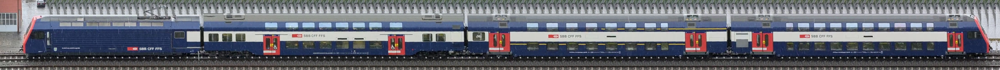

# Onlytrains


Watches a piece of train track, detects passing trains, and stitches together images of them.
Should work with any video4linux USB cam, or Raspberry Pi camera v3 modules.

Frontend: <https://trains.jo-m.ch/>

Other deployments:

- <https://trains.shakik.de/>
- <https://trains.rahix.de/>

[A collection of some "special" sightings.](https://trains.jo-m.ch/#/trains/list?filter={%22where%22:{%22favs%22:%22id+IN+(577,2405,2320,2193,1342,1039,343,407,350,307,1724,887,2485,3002,2950,2949,2896,2870,2853,2839,2827,2815,2802,3403,3224,3008,2766,2483,3410,3425,3424,3592,3576,3986,3715,2462,3846,3903,3981,3999,3971,4045,4160,4051,4362,4300,4504,4484,4456,4669,4794,4792,4790,4796,4797,4801,4813,4814,4815,4816,4818,4820,4827,4829,4831,4841,4840,4839,4876,4874,4873,4855,4844,4894,4890,4889,4883,4882,5058,5045,5272,5257,5241,5148,5146,4823,5437,2754,3770,3768,4025,4158,4426,4430,5325,5401,6124,6567,6560,6553,5972,5535,5700,6786,7232,8332,8334,8137,7911,8532,8518,8496,8415,7956,7939,7136,7000,7001,9328,9321,9286,9281,9213,9207,9188,9649,9648,9621,9614,9584,9529,9528,9450,9422,9268,9231,9179,9175,8786,8588,11529,11420,11406,11224,11292,11223,11199,11101,11094,11027,11014,10773,10626,10349,10333,9846,9866,9814,12424,12345,12324,12216,12219,12221,12226,12235,12556,13024,12607,13267,13989,13988,13979,13914,13909,13896,13886,13728,13513,13507,13461,12410,12331,14193,14184,14213,14252,14336,14362,14373,13420,3643,13489,13460,13499,15347,15276,15263,15201,15068,15033,14985,14809,14821,14702,15443,15435,15414,15374,17103,17089,17088,17087,17084,17063,17058,17054,16954,16952,16896,16895,16890,16878,16876,16864,16856,16838,16690,16644,16388,16386,16296,16283,16282,16269,16255,16239,16152,16127,16113,16100,16086,16072,16053,15923,15885,15879,15877,15874,15783,15691,15673,15615,15577,15564,18079,14479,138,11810,18090,17983,17974,17962,17956,17860,17581,17536,17472,17471,17468,17305,17252,17211,17190,18288,18599,18538,20417,20421,20150,19604,19515,19259,19260,20426,15457,21289,20885,20862,20818,20808,20479,19387,19342,19317,18342,21282,21215,21098,21085,21782,21775,21749,21737,22835,19805,20863,22033,22317,22360,22655,23107,23215,23185,23244,23253,23258,23373,23445,23510,23538,23587,23562,23614,23671,23905,23906,23923,24016,24046,25260,25205,25087,25054,25024,24930,24508,24496,24487,24409,24378,24274,25636,25617,25616,25595,25587,25533,25298,27421,27388,27305,27301,27157,27154,27141,26997,26923,26811,26752,26713,26701,26588,26535,26521,26412,26394,26281,26274,26198,26141,25851,25777,25776,25752,25664,28510,28505,28393,28475,28503,28390,28310,28241,28180,28080,27560,29291,29282,29275,29252,29158,29096,29088,32739,32732,32702,32694,32590,32395,32380,33881,33855,33850,33816,33803,33725,33675,33489,33390,33352,33320,33309,33290,33165,33070,33063,33057,33044,35491,35483,35470,35455,35569,35526,35497,35578,36292,36271,36264,36257,36250,36236,36237,36223,36224,36144,36137,36119,35966,35958,35938,35898,35883,35872,35858,35774,35763,35766,35754,35746,35704,35700,35684,36662,36656,36604,36583,36558,35945,35591,34616,34581,34579,34396,38139,38129,38097,37680,37664,37358,37308,37302,37220,37229,37054,37035,37026,36983,36779,36739,36686,36682,36681,36680,36674,36667,38315,39734,40372,39993,39939,39924,39900,39792,39392,39358,38860,39151,38845,38818,38813,38729,38728,38710,41922,41901,41822,41816,41756,41685,41671,41672,41614,41609,41596,41454,41446,41274,41183,41140,41038,41030,40920,40813,40788,40700,40402,40166,39782,38735,42840,42836,42787,42747,42616,42584,42581,42543,42536,42401,42367,42326,41966,43697,43680,43291,43208,43079,43976,44010,43966,43951)%22}})

The name Onlytrains is credited to [@timethy](https://github.com/timethy).

[](internal/pkg/stitch/testdata/set0/day.jpg)
[](internal/pkg/stitch/testdata/set0/night.jpg)
[](internal/pkg/stitch/testdata/set0/rain.jpg)
[](internal/pkg/stitch/testdata/set0/snow.jpg)
[](demo.gif)

It also contains some packages which might be useful for other purposes:

* [pkg/pmatch](pkg/pmatch/pkg.go): Image patch matching
* [pkg/ransac](pkg/ransac/ransac.go): RANSAC algorithm implementation
* [pkg/vk](pkg/vk/pkg.go): Vulkan compute framework

The binaries are currently built and tested on X86_64 and a Raspberry Pi 4 B.

## Assumptions and notes on computer vision

The computer vision used in trainbot is fairly naive and simple.
There is no camera calibration, image stabilization, undistortion, perspective mapping, or "real" object tracking.
This allows us to stay away from complex dependencies like OpenCV, and keeps the computational requirements low.
All processing happens on CPU.

The assumptions are (there might be more implicit ones):

1. Trains only appear in a (manually) pre-cropped region.
1. The camera is stable and the image does not move around in any direction.
1. There are no large fast brightness changes.
1. Trains have a given min and max speed (configurable).
1. We are looking at the tracks more or less perpendicularly in the chosen image crop region.
1. Trains are coming from one direction at a time, crossings are not handled properly
  1. In practice, they happen and lead to the result of one train being chopped up, e.g. https://trains.jo-m.ch/#/trains/19212.
1. Trains have a constant acceleration (might be 0) and do not stop and turn around while in front of the camera.
  1. In reality, this is often not true, there happens to be a stop signal right in front of my balcony...

## Documentation

As this is just a hobby project for me, the documentation is pretty sparse.
This very README is the most important part of it.
To deploy this project yourself, you should have some basic sysadmin, web servers, and ideally Go knowledge.
When in doubt, the source of truth is ... the source code.

All config options can be passed as ENV vars or CLI flags.
See `config struct` on top of `cmd/trainbot/main.go`, or run `trainbot --help` to see all options.

The two Makefiles (root and frontend/) also contain some hints.

## Deployment

There are two parts to deploy: First, the Go binary which detects trains, and second the web frontend.

How to get binaries?
There are multiple options:

1. `go install jo-m.ch/go/trainbot/cmd/trainbot@latest`
2. Grab a binary from the latest CI run at https://github.com/jo-m/trainbot/actions
3. Build via tooling in this repo - see [Development](#development)

### Raspberry Pi

Run the interactive tool to adjust camera and select a crop rectangle:

```bash
# On the host machine
make deploy_confighelper host=TRAINBOT_DEPLOY_TARGET_SSH_HOST
# Example:
make deploy_confighelper host=pi@10.20.0.12

# On the raspberry pi
sudo usermod -a -G video pi
# The --input arg has to be adapted to your actual camera config.
./confighelper-arm64 --log-pretty --input=picam3 --listen-addr=0.0.0.0:8080
```

Example "Production" deployment to a remote host (will install a systemd user unit):

First, you need to create a `env` file (copy `env.example`).
Then, from the host machine:

```bash
make deploy_trainbot host=TRAINBOT_DEPLOY_TARGET_SSH_HOST

# To see logs, on the target device:
journalctl --user -eu trainbot.service
```

Download latest data from Raspberry Pi:

```bash
ssh "$TRAINBOT_DEPLOY_TARGET_SSH_HOST" sqlite3 trainbot/data/db.sqlite3
.backup trainbot/data/db.sqlite3.bak
# Ctrl+D
rsync --verbose --archive --rsh=ssh "$TRAINBOT_DEPLOY_TARGET_SSH_HOST:trainbot/data/" data/
rm data/db.sqlite3-shm data/db.sqlite3-wal
mv data/db.sqlite3.bak data/db.sqlite3
```

### Frontend

## Web frontend

The frontend is a VueJS SPA app written in Typescript.
It consists of only static files (after the JS build process).
There is no web backend, the frontend simply loads the entire SQLite database from the server, and then does all the queries itself.
This means that the frontend can be deployed entirely independently from the trainbot binary, as long as there is some way for the date (db + pics) to get to the web server.

#### My setup

My Raspberry Pi is not exposed to the internet, and I also already had a web hosting account with FTP access available.
Thus, in my setup, the binary and the frontend are running on two entirely different machines in two different networks.

The frontend is built and deployed via:

```bash
export FRONTEND_DEPLOY_TARGET_SSH_HOST=myuser@mywebserver:/var/www/trains/
cd frontend
make deploy
```

The binary on the Raspberry Pi in my home network will upload pictures and the updated db file via FTP to this webspace whenever a new train is detected.
This is configured via the `ENABLE_UPLOAD=true` and `UPLOAD_...` env vars (or the corresponding CLI flags).

Alternative uploaders (e.g. SFTP, SCP, WebDAV, ...) could be pretty easily implemented (but they are not because I do not need them).
For this, the `Uploader` interface from `internal/pkg/upload/upload.go` needs to be implemented, and corresponding configuration options added.

#### Hosting the frontend on the same machine

It is possible to deploy the fronted on the same machine where trainbot runs.
There is no finished solution provided in this repo, but some hints are here:

- Install an arbitrary static web server (Nginx, Apache, Caddy, ...).
  - A webserver could also added to the trainbot binary itself, see e.g. [here](https://eli.thegreenplace.net/2022/serving-static-files-and-web-apps-in-go/), PRs welcome.
  - As wwwroot, this webserver needs the build output of the frontend, i.e. `cd frontend; make build; [s]cp dist /var/www/trains`.
- Set up the trainbot binary to have its data directory somewhere inside the wwwroot via `--data-dir / DATA_DIR`.
  - Assuming the wwwroot is `/var/www/trains`, trainbot would be running with `--data-dir=/var/www/trains/data`

Note that this can lead to transient inconsistencies when the web server is delivering the sqlite file at the same time the binary is writing to it.
The clean solution would be to add another "local FS" uploader to trainbot (see previous section).

### Hardware

I use a Raspberry Pi 4 Mod B with 2GiB of RAM, and a Raspberry Pi Camera v3 (narrow lens).
Distance from camera to tracks is ca. 50m.

All this is installed on my balcony in a waterproof case, as seen in the [MagPi Magazine](https://magpi.raspberrypi.com/issues/131).

The case is this one from AliExpress: https://www.aliexpress.com/item/1005003010275396.html

#### 3D Prints

- Mounting plate for Camera: https://www.tinkercad.com/things/1FowVwonymJ
- Mounting plate for Raspberry Pi: https://www.tinkercad.com/things/djlEF6oQSY1
- The prints were ordered from JLCPCB.

**Errata (not corrected in the models linked above):**

- The RPI mounting plate is 1-2mm too wide, because the 86mm stated in the picture on the Aliexpress product page are in reality a bit less.
  - You can solve that by changing the 3d design, or by cutting off a bit from the print. It might however also depend on your specific case.
- The RPI USB C power plug does not fit into the case, because the case is in the way.
  I solved this by cutting it off and soldering the cable to the connector perpendicularly.
  You can probably fix this by changing the 3D design to move the RPI to the left as far as possible.

## Development

This repo is set up to compile for `x86_64` and `aarch64`.
There is support for building on your machine directly, or inside a Docker container.

Also, there is an extensive test suite.
Tests may also be executed locally, or inside Docker.

The single entrypoint for everything (incl. Docker) is the `Makefile`.
You can list available targets via `make list`.
Same is true for the frontend - check out [frontend/Makefile](frontend/Makefile).

Example:

```bash
git clone https://github.com/jo-m/trainbot
cd trainbot
make docker_build

# Find binaries in build/ after this has completed.
```

## Vulkan

To work with the Vulkan code, you need to activate the `vk` build tag.
For VSCode, add the following to `.vscode/settings.json`:

```
"go.buildTags": "vk,moretests"
```

## V4L Settings

```bash
# list
ffmpeg -f v4l2 -list_formats all -i /dev/video2
v4l2-ctl --all --device /dev/video2

# exposure
v4l2-ctl -c exposure_auto=3 --device /dev/video2

# autofocus
v4l2-ctl -c focus_auto=1 --device /dev/video2

# fixed
v4l2-ctl -c focus_auto=0 --device /dev/video2
v4l2-ctl -c focus_absolute=0 --device /dev/video2
v4l2-ctl -c focus_absolute=1023 --device /dev/video2

ffplay -f video4linux2 -framerate 30 -video_size 3264x2448 -pixel_format mjpeg /dev/video2
ffplay -f video4linux2 -framerate 30 -video_size 1920x1080 -pixel_format mjpeg /dev/video2

ffmpeg -f v4l2 -framerate 30 -video_size 3264x2448 -pixel_format mjpeg -i /dev/video2 output.avi
```

## RasPi Cam v3 utils

```bash
# setup
sudo apt-get install libcamera0 libcamera-apps-lite
sudo apt install -y vlc

# grab frame
# https://www.raspberrypi.com/documentation/computers/camera_software.html#libcamera-and-libcamera-apps
libcamera-jpeg -o out.jpg -t 1 --width 4608 --height 2592 --rotation 180 --autofocus-mode=manual --lens-position=2
libcamera-jpeg -o out.jpg -t 1 --width 2304 --height 1296 --rotation 180 --autofocus-mode=manual --lens-position=4.5 --roi 0.25,0.5,0.5,0.5

# record video
DATE=$(date +'%F_%H-%M-%S'); libcamera-vid -o $DATE.h264 --save-pts $DATE.txt --width 1080 --height 720 --rotation 180 --autofocus-mode=manual --lens-position=0 -t 0

# stream through network
libcamera-vid -t 0 --inline --nopreview --width 4608 --height 2592 --rotation 180 --codec mjpeg --framerate 5 --listen -o tcp://0.0.0.0:8080 --autofocus-mode=manual --lens-position=0 --roi 0.25,0.5,0.5,0.5
# on localhost
ffplay http://pi4:8080/video.mjpeg

# manually record video for test cases
libcamera-vid \
   --verbose=1 \
   --timeout=0 \
   --inline \
   --nopreview \
   --width 240 --height 280 \
   --roi 0.429688,0.185185,0.104167,0.216049 \
   --mode=2304:1296:12:P \
   --framerate 30 \
   --autofocus-mode=manual --lens-position=0.000000 \
   --rotation=0 \
   -o vid.h264 --save-pts vid-timestamps.txt

mkvmerge -o test.mkv --timecodes 0:vid-timestamps.txt vid.h264
```

## Code notes

* Zerolog is used as logging framework
* "Library" code uses `panic()`, "application" code use `log.Panic()...`

## Prometheus metrics/Grafana

For debugging and tweaking a [Prometheus](https://prometheus.io/)-compatible endpoint can be exposed at port 18963 using `--prometheus=true`. A [Grafana dashboard](grafana/Onlytrains-dashboard.json) is also available.

## Flow chart for frame data
```

           libcamera-vid
                 │
                 ▼
        ┌─────────────────┐
        │                 │
        │   source queue  │
        │                 │
        └─────────────────┘
                 │
                 ▼
             findOffset ──────► discard
                 │
              record
                 │
                 ▼
          ┌────────────┐
          │            │
          │  sequence  │
          │            │
          └────────────┘
                 │
                 ▼
               fitDx
                 │
                 ▼
              stitch
                 │
                 ▼
           ┌───────────┐
           │           │
           │   image   │
           │           │
           └───────────┘

```

## TODOs

- [ ] Replace deprecated `s.cam.GetOutput()`
- [ ] Fix false positives in darkness
- [ ] Add machine learning to classify trains (MobileNet, EfficientNet, https://mediapipe-studio.webapps.google.com/demo/image_classifier)
- [ ] Remote blob cleanup is broken due to FTP LIST being restricted to 99998 entries by remote - use sftp instead
- [ ] Select image processing methods depending on build tags (Vulkan)
- [ ] Maybe use some stuff from https://daniel.lawrence.lu/blog/y2025m09d21/
