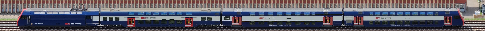
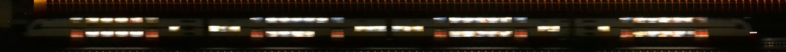
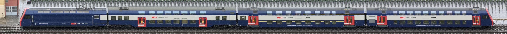
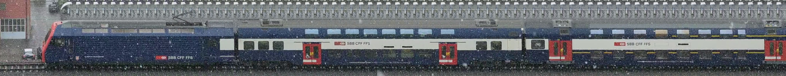
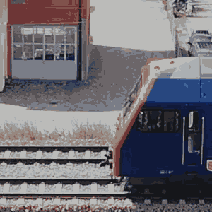

# Trainbot

**THIS IS A WORK IN PROGRESS**

Trainbot watches a piece of train track, detects passing trains, and stitches together images of them.
Should work with any video4linux USB cam, or Raspberry Pi camera v3 modules.

Frontend: <https://trains.jo-m.ch/>

[](internal/pkg/stitch/testdata/day.jpg)
[](internal/pkg/stitch/testdata/night.jpg)
[](internal/pkg/stitch/testdata/rain.jpg)
[](internal/pkg/stitch/testdata/snow.jpg)
[](demo.gif)

It also contains some packages which might be useful for other purposes:

* [pkg/pmatch](pkg/pmatch): Image patch matching
* [pkg/ransac](pkg/ransac): RANSAC algorithm implementation

The binaries are currently built and tested on X86_64 and a Raspberry Pi 4 B.

## Assumptions and notes on computer vision

The computer vision used in trainbot is fairly naive and simple.
There is no camera calibration, image stabilization, undistortion, perspective mapping, or "real" object tracking.
This allows us to stay away from complex dependencies like OpenCV, and keeps the computational requirements low.
All processing happens on CPU.

The assumptions are (there might be more implicit ones):

1. Trains only appear in a (manually) pre-cropped region.
1. The camera is stable and the image does not move around in any direction.
1. There are no large fast brightness changes.
1. Trains have a given min and max speed.
1. We are looking at the tracks more or less perpendicularly in the chosen image crop region.
1. Trains are coming from one direction at a time, crossings are not yet handled properly.
1. Trains have a constant acceleration (might be 0) and do not stop and turn around while in front of the camera.

## Build system

There is a helper `Makefile` which calls the standard Go build tools and an arm64 cross build inside Docker.

## V4L Settings

```bash
# list
ffmpeg -f v4l2 -list_formats all -i /dev/video2
v4l2-ctl --all --device /dev/video2

# exposure
v4l2-ctl -c exposure_auto=3 --device /dev/video2

# autofocus
v4l2-ctl -c focus_auto=1 --device /dev/video2

# fixed
v4l2-ctl -c focus_auto=0 --device /dev/video2
v4l2-ctl -c focus_absolute=0 --device /dev/video2
v4l2-ctl -c focus_absolute=1023 --device /dev/video2

ffplay -f video4linux2 -framerate 30 -video_size 3264x2448 -pixel_format mjpeg /dev/video2
ffplay -f video4linux2 -framerate 30 -video_size 1920x1080 -pixel_format mjpeg /dev/video2

ffmpeg -f v4l2 -framerate 30 -video_size 3264x2448 -pixel_format mjpeg -i /dev/video2 output.avi
```

## RasPi Cam v3 utils

```bash
# setup
sudo apt-get install libcamera0 libcamera-apps-lite
sudo apt install -y vlc

# grab frame
# https://www.raspberrypi.com/documentation/computers/camera_software.html#libcamera-and-libcamera-apps
libcamera-jpeg -o out.jpg -t 1 --width 4608 --height 2592 --rotation 180 --autofocus-mode=manual --lens-position=2
libcamera-jpeg -o out.jpg -t 1 --width 2304 --height 1296 --rotation 180 --autofocus-mode=manual --lens-position=4.5 --roi 0.25,0.5,0.5,0.5

# record video
DATE=$(date +'%F_%H-%M-%S'); libcamera-vid -o $DATE.h264 --save-pts $DATE.txt --width 1080 --height 720 --rotation 180 --autofocus-mode=manual --lens-position=0 -t 0

# stream through network
libcamera-vid -t 0 --inline --nopreview --width 4608 --height 2592 --rotation 180 --codec mjpeg --framerate 5 --listen -o tcp://0.0.0.0:8080 --autofocus-mode=manual --lens-position=0 --roi 0.25,0.5,0.5,0.5
# on localhost
ffplay http://pi4:8080/video.mjpeg
```

## Deployment

### Raspberry Pi

```bash
sudo usermod -a -G video pi

# confighelper
./confighelper-arm64 --log-pretty --input=picam3 --listen-addr=0.0.0.0:8080
```

The current production deployment is in a Tmux session...

```bash
source ./env

while true; do
./trainbot-arm64 --log-pretty --log-level=info \
   --input picam3 \
   --camera-format-fourcc=MJPG \
   -X 1200 -Y 930 -W 206 -H 320 \
   --px-per-m=42
done
```

Download latest data from Raspberry Pi:

```bash
ssh "$TRAINBOT_DEPLOY_TARGET_SSH_HOST" sqlite3 data/db.sqlite3
.backup data/db.sqlite3.bak
# Ctrl+D
rsync --verbose --archive --rsh=ssh "$TRAINBOT_DEPLOY_TARGET_SSH_HOST:data/" data/
rm data/db.sqlite3-shm data/db.sqlite3-wal
mv data/db.sqlite3.bak data/db.sqlite3
```

### Web frontend

Images and database are uploaded to a web server via FTP.
The frontend served as a static HTML/JS bundle from the same server.
All database access happens in the browser via sql.js.

## Code notes

* Zerolog is used as logging framework
* "Library" code uses `panic()`, "application" code use `log.Panic()...`

## TODOs

- [x] Also create GIFs
- [x] Test in snow/bad weather
- [x] Clean up and document build system
- [x] Calculate length
- [x] Write GIFs again
- [x] Store metadata in db
- [x] Sync pics and db up to bucket
- [x] Static web frontend serving train sightings
- [x] Github button link
- [x] Filter view (longest, fastest, ...)
- [x] Fix stale relative timestamps
- [x] Improve train detail view
- [x] Store filter state in URL
- [ ] Create some screenshots
- [ ] Color theming, dark mode
- [ ] Logo/Favicon
- [ ] Set up aggressive caching on web server
- [ ] Better deployment setup, remove hardcoded stuff, document deployment
- [ ] Delete old data after upload
- [ ] More debug logging and better filtering, clean up data
- [ ] Deploy to Raspberry Pi via [gokrazy](https://gokrazy.org/)
- [ ] Add run/deploy instructions to README (including confighelper)
- [ ] Improve stiching seams
- [ ] ~~Maybe add audio~~
- [ ] ~~Maybe make RaspiCam3 sensor mode configurable, and add support for detection~~
- [ ] ~~Maybe move patchmatch to separate repo~~
- [ ] Add machine learning to classify trains
