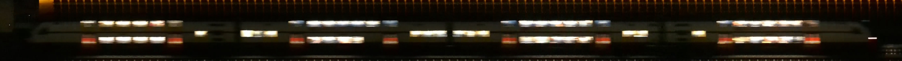

# Trainbot

**THIS IS WORK IN PROGRESS AND INCOMPLETE**

Trainbot watches a piece of train track with a USB camera, detects trains, and stitches together images of them.

[](pkg/stitch/testdata/test1.jpg)
[](pkg/stitch/testdata/test2.jpg)

It also contains some packages which might be useful for other purposes:

* [pkg/pmatch](pkg/pmatch): Image patch matching
* [pkg/cqoi](pkg/cqoi): [QOI](https://github.com/phoboslab/qoi) C wrapper
* [pkg/ransac](pkg/ransac): RANSAC algorithm implementation

The binaries are currently built and tested on X86_64 and a Raspberry Pi 4 B.

## Assumptions

1. Trains only appear in a (manually) pre-cropped region.
1. The camera is stable and the image does not move around in any direction.
1. There are no large fast brightness changes.
1. Trains have a given min and max speed.
1. We are looking at the tracks more or less perpendicularly in the chosen image crop region.
   No fancy camera calibration or geometric correction takes place, we are d
1. Trains are coming from one direction at a time, crossings are not handled properly.
1. Trains have a constant acceleration (might be 0) and do not stop and turn around.

## V4L Settings

```bash
# list
ffmpeg -f v4l2 -list_formats all -i /dev/video2
v4l2-ctl --all --device /dev/video2

# exposure
v4l2-ctl -c exposure_auto=3 --device /dev/video2

# autofocus
v4l2-ctl -c focus_auto=1 --device /dev/video2

# fixed
v4l2-ctl -c focus_auto=0 --device /dev/video2
v4l2-ctl -c focus_absolute=0 --device /dev/video2
v4l2-ctl -c focus_absolute=1023 --device /dev/video2

ffplay -f video4linux2 -framerate 30 -video_size 3264x2448 -pixel_format mjpeg /dev/video2
ffplay -f video4linux2 -framerate 30 -video_size 1920x1080 -pixel_format mjpeg /dev/video2

ffmpeg -f v4l2 -framerate 30 -video_size 3264x2448 -pixel_format mjpeg -i /dev/video2 output.avi
```

## Code notes

* Zerolog is used as logging framework
* "Library" code uses `panic()`, "application" code use `log.Panic()...`

## TODOs

- [ ] Also create GIFs
- [ ] Crop stitched images to exact W H
- [ ] Use FFMPEG or Gstreamer for camera input, the Go webcam library often crashes after a couple 100s of frames
- [ ] Use https://github.com/stapelberg/turbojpeg for faster jpeg encoding
- [ ] Move rec package to internal or remove entirely
- [ ] Move all "application" code to internal/
- [ ] Deploy via Gokrazy
- [ ] Maybe move QOI and patchmatch to separate repos
- [ ] Add run/deploy instructions to README (including confighelper)
- [ ] Add Telegram or Twitter bot, or serve a page with recent trains
